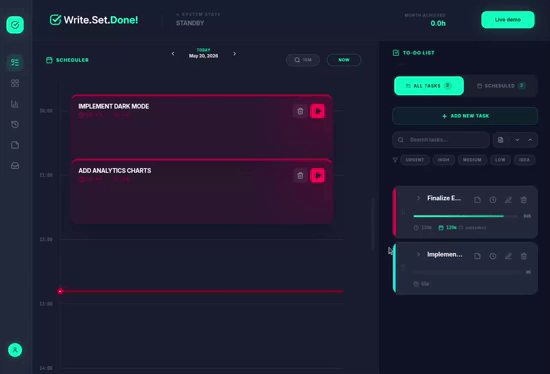

# Hello, I'm Branislav

I enjoy working across the full system and understanding how decisions in one part of a system affect everything around it. Most of my work sits between full-stack engineering, backend architecture, and product thinking, with a focus on building things that stay simple as they grow.

<h3>Technologies and tools I use</h3>

  
  
  
  
  
  
  
  
  
  
  
  
  
  
  
  
  
  
  

---

## 🔥 Featured Products

### Write.Set.Done!

A productivity system built to close the gap between planning and actually doing.

- Time-blocking with realistic estimation
- Feedback loops tied to daily scheduling
- Workflow: Idea → Planned → Scheduled → Done
- Designed for consistency, not task volume

---

### Yugen

![Yugen demo](data:image/jpeg;base64,/9j/4AAQSkZJRgABAQAAAQABAAD/2wCEAAkGBxMSEhUTExMVFhUXGBkXGBcYGBgYGBoYGBUXGBcYFRoYICggHxolHhcXITEiJSkrLi4uFx8zODMtNygtLisBCgoKDg0OGRAQGi0fHR0tLS0tLS0tLS0tLS0tLSstLS0tLTctLS0tLS0tLS4tLS0tLS4tNS0tLS0uLS0tLS0tLf/AABEIAKgBLAMBIgACEQEDEQH/xAAbAAACAwEBAQAAAAAAAAAAAAAAAgEDBAUGB//EAEAQAAEDAQQGBwYGAQIHAQAAAAEAAhEDEiExUQRBYXGR8AUTFCKBscEGMlKh0eEVM0JigvEjktI0Q1NUcqKyFv/EABgBAQEBAQEAAAAAAAAAAAAAAAABAgME/8QAJxEBAQACAQMCBQUAAAAAAAAAAAECERIDEzEh8EFhcaHBBCJRgZH/2gAMAwEAAhEDEQA/AOUw6R1L6wjq3/4nHuyRuxi8CRmsbg97bZghoDcrlkc5+AN2X12oaX4E3HGPFZmGMu5FytzvLL1q2yZjm/BXt0GqQCG3GIN2vDWn0bQ2ua4msxpBIAOLsMJjGdcYalY7o5k/8RTON98XajdzC0jPX0KowS5sDbG7PYqzQeG2y02YmYERxW0dGMujSaV5A/UImbySMBHzCrp9HMMf5qYum/Ue7dnrOr9JQUaPoz3hxaPcbbdMCGjXBN+dysPR9WJs3XXyIvuF87VZ+Hssz19ObMxrn4d/01KjTdGawEtqNef2+N+Gz5hBZ+G1fg+Y+qgdH1T+n5j67Fy+uPIR1x5CDodlfbsR3srspzjBKKLoLoubAOwlYhXcjr3INrqDhZkRavG5BoutWP1YLF2h2aOvdmg3dnd3rvd97Zjt2FQ+k4AE4Ow8DCw9e5T2h2aDeGOY9outSCNd9xHotFTS6hlhbTw+BoujVkb1yDXco64oOydNq4kMO0sacb1B02pcYZiCDYAN2GGr6Lj9e5T2h2aDrVqlSp3TZMX3CMJ+p+SzCk6Juxjm9Yu0OzR2h2aDZVpOaYdcecikWXr3I69yDUhZevcjr3INSFl69yOvcg1IWXr3I69yDUhVUy64nDZ/SspUKrhLWkjC4E3+AQShDtGrC8tIjHun53KgOfqBIwmLkHS0To99SbMGNwx3lJX0N7HBpiSQOOGuFhNao0XyBtH1SO0lxxK9eWf6bt6mN5a8/P8A38PPMetz3cpx9/L8uk3Q3Wi24Q20SZAiAZz15Kvs7pIAmDFyxDSnDWrqRc4SWvdtAu8ivI9CW0iLBLXgR3pMhxnEc69kmvpkFrMC03arJxXQ0tjoaSWkECLIj9IxuF+F6z+1DnFotva91lskajPuuOtwz8JuQea613xHiUda74jxKRRKCzrXfEeJR1rviPEquUSgs613xHiVHWu+I8SklEoHtnM8UWzmeKREoHtnM8UWzmeKSUSge2czxRbOZ4pUIGtnM8UWzmeKVRKB7ZzPFFs5niklEoHtnM8UWzmeKSUSge2czxRbOZ4pJRKB7ZzPFFs5niklEoHtnM8UWzmeKSUSge2czxRbOZ4pJRKB7ZzPFaujjLjN93qFilbOjPeO71CD0+hGoNHdZpkskB74kAOAgHK8Ag7FXodsUqr2vLRTLZAJFq0XYRlZWanXcGWQTYuLhfZmLpi6VfobJa9udx4H6q4ybm/G5v6bm/sluorqdKVHXOfUINxBeSDqvzWVlYjBzxfMB0CVUpVyxuGVxvmLLtZUql3vOed7p81XA28R9EKFkaauguYYe1zTAdBycJBUtYRcHuA2GFFJ5MkknDEznmrEGzTXUoY2m0i6XPIMuJiQGzFlt4Gs4lYvaQ07JFNpawQAXTafDr3uGAJyFwhbdPqVC2nbjCWiL7MNAc7YQBG6Yvvz+1rKrZFWLUMNzbNx7wEQMJs/xjUg8T0j+nx9Flha9PGHisoW8fDFAHOxTfO29S0TrjXfs9VDnLSITxv5wVasaed6KLKsPP8AaSZ+ikD5qG0OjeppCDOpNclJvhUWvJC1UWtdAJicTjffz4qig26/nipAszx4jWooeI54qg8/NO50xzr5KIvjPz3oKi1RH23q17Y53pXkZed++9BU4KC1OROtQgUbublBTEXen1Un0RVcJSrCFDuCIrKghW61UVApSlODz/SQhFWUSLQjMcLWS9L0Z7x3eoXmaHvt/wDIea9N0Z7x3eoWarv6NoxdScQ6AcRAvhs3nV9VOiV2tBk6yp0TQXvpue28MaHOAkkCQJuG2b9QOSfQKjQ11qj1mPel4s/6buPyUSzajSW03GQ6DryO8KpujMP/ADWjaQ6P/WT8l0+uZ/2o/wBVX/csFWkbZd1Xd+E2gBfnjsWs88s5q3+/j7+pjjpmqUowc07QT6gJLO7iFe8AggUgDnaddxKo6h2SxGqtoGJkjiFZbGY4rN1ByV9K4QabXbST6FVGvSOrhoYTMAunM6hcML79qydP9XY/xzZhs2jfautHAQJ1Xrp9IOq9XSbUbDSHVGYyQ4wTec24bln9sreNQUg4spmKeAEAAOGp8C8IPD6fq8VnYr+kf0+KysXXHwxl5OlhWlnhs1pC3n+1dM7DW/Lz5CGj5XqQ1PZ4IIaIUzzjw80FvIUFBHFNAQGpiUVYwqX3Cb42834KKWCYibvmsqoKezzr5xSnUB4LRozi2RqMKitzOQqz6K8kX3QFU4f2gqfzzklCYjaglVUQpepCFkKEt6shVlBWlcFYUr0CFKQmUOKim0dvfbeM8teG9ek6M947vULzNH327x5r1HRDC55A+E+izVjsUXEC4kSL/umpVXAQHEAzIBIB1XhJTwG5DMOPmoN1DSrn2qlS1EthxvdI97wlXaQ+jDAK1ZwI74cIE3HuwTPjkmoVqj2CzSa4U7TidgpnESMBLvBaKIrC2wUmf5mOEWmwAQwktl1z7hAN/ewvQYHdR1Zi31kmL+6G6rovPiFn0kskWJiBMmb9erVh4LsV6lW0ar6FIWJpEAtZB1Q0OtSIOd05XYtKq1G0m03MaGul7SCDdbOEE3SCL8kHPQhCC/SHgtZBMht8kmDJuEi4QAbs1j6eDLBDCSLpJ1mbyBAgYYrdpVMgMkDC4gkzvnXhhcqPanSC9suptpkNY2y0ECG3TffJvQeM08e74rO0c/VatL1eKzwu2HhyyvqGuTc/JK0JwtM7AbuVgGPOWKG88+CkRvQ2rcUtrVqx+SsLUCmhtEfZFpO6mVAZuRdgNjd98AVcG/JKGp2bVlqK6es65uTmnBTGmcAlggiVFI4EqpzjjtWp9PWsrhfziqhbGvx+yLPz5uVpvVT0U0KatItxBEiQTlqI2IBjkJqlUkAEzAgTq2KCiFBCYDaoKKRI4eP9K2JVbgoEKRw5wVhEZpCOdSAonvNG0H5r1ns/+b/E+i8nRHfbvHmvWez/AOb/ABPosVp0qWA3IZhx80UsBuQzDj5qC6nXe0FrXuANxAcQDIgyBjdcmGl1Lv8AI+6QO864HEC+4FUoQWdofBbbdBvItGCdoUVKrnRac50XCSTAyE4BIhAIQhB7To72NbV6OdphrvBbTrVAyBZmna1k67AXg+mAOr7pkGD4zfvwXQ0226h1IqV2B1prg15DLJIuDZvnvAiNe9crT9CNGgKZBFmAJx97Wg87pmpUhX6WJjxVAC74eHDPykCL0yYNm/nn6J7F+K2xsgTNbtThqcMhCVAbzv8A6UWAVY3nwUgKLshCgi/n5q6yoDIRVbWFMxqZjYMK0U9qlalDGApn0ZgEYnzTNF62xMAwI2R5eaxW4wVaEYH1XNqhegrskXDneuTpNA+HPyVhYxtckeZVz6X9qmpT1fNVk7GEi1+kEDViZIEeBSn5cyhrCL1JlFKlKuNO6dWGPkqYyWWkOhI4J4553JC3yQI4JQOdytLVBHJWashKLe+3eF6r2f8Azf4n0Xl6Le8N4XqPZ/8AN/ifRZqulSwG5DMOPmilgNyhrh5+agdCUvGYR1gzHFAyEvWDMcUdYMxxQMhL1gzHFHWDMcUFzq7jEnAzgBfncFj6Zql1M2jN481oWTpT8s7x5oOE6nPOah2jFbuj6VonZHqtw0VdMc9Rzyw3XF6nepNJdh2hpeyc7FuZsXp1zOr588UFkLq9lU9ila5xO3XJsKxjV0naFs3KOypyiTCxhbTTdXjcugNG2JhoqzybmFc8UlYyktw0ZOzR1m5NzBjFAfZaKdK5XdQVdSp7Vi5OmOLEKarraGI26oXRFG9aHaJKxc9NzDbzFfRhqCzDRb16qtoRIw8dZ3rFV0IhWdWJei887R0jqWzeu1V0VU9kK1zZ4ORXJOOoRww52KktvxXWraOsr6G7nYrMmbKxkJXNWnqyNVynq0tWRicVUXrTUpmblmqU4URFI95u8L1Xs/8Am/xPovKUfebvHmvV+z/5v8T6KVXSpYDctGh12tHepNfefeLx/wDJHMrPSwG5NRmDHpqMjFQGlODnAtY0D4ZJGH7iSltD/o0+L/8AcpqbfT0UMfBkIK6LS2ZY105zdugpatIkyGhuwEx85K2NruJMRLrjcPlkpNsQchHmg5/UFaKYsiDTaTmZm9XGsYcLu8QTn/V6RzybySd96AWTpT8s7x5rWsnSn5Z3jzQT7L6PbNTYG/O0vQjo9ee9ktPZTqua8gB7RDiQAC03C/O18l7dhm8LhnbK9HTmNjl/h8pH9FldxkawtbGsKx3Mo6duV5I6BGpW0tDXpn6I0qaWhMzWu96J2fV54aAFP4aMl6pmhsTHRWrHfb7MeRHR2xQdB2Lv9J6VQ0cTVqNZMxOJiJgDHELhVfajQsTVIET7rvRbnVtYywxnxVHQ0zdHXH0725otcBTpueIMkmyZuiMZGPBNQ9sWEd6k4GJucDf9MFq5Vz/b/LsO0VJ2ZcXRfbVsf5KRBk4G6NWOtLW9sWn3GXQcTfMXEbFOVa3i7ZobFp0Vi8s32uvbLQQLnbTnzkrx7YsDCbPeuu1Y/RS21ZljHqzSELJWotvXJ/8A09NzC8AyCJacjkc1z3e1uJ6uWzcQb4n9Q+6xMK1epi7L9FCyVtGAXE0HpqzacSe8+L2i8QSCdci4Y6wu2a4cGmfewGvNdNWMcpWSrSCy1KAWusFjfK6SVi2MlZglZiMgOQtlVqzPaVuOdYaoWSo0LfUWaoxajFUUotDHEZZ3r1Hs/wDm/wAT6LzLZtNmTeMd67/Rnvnd6hSkdmlgNyam0Rec9W1LTwG5PTqMskFptTcZuF+UX6+Kin6pvdh2I712H1S2G568I1ZrHUpVLUis6LU3kxFqS2LOEbV6BunaPdLHYXwTjn7vMoOaKbYcbV4iBB7047oSADNdKrplCO6CDOJJN18iLI2cFV2qnn8j9EGCEBdOlplIB1q8kXXG454Ll6Y8F0jC5AyydKflnePNa1k6U/LO8eaDy/SX6fH0Xp/Yz2gDbNGo6GgGCcANpOH34eV6VPu+PosQKzZtZdXb6zX9qNFa0kVATeBjjBx2SAJ2ryvSHtrXtu6shrJNm4TF4E3nYd4XkiUWlnjG71LXp9D9tdJpmS4OkRDhkCBtxMr1HRnt5RfYFQFrzNqAYB/SBmTzkvl5clDiE4SpOplH2vSfaXR2MLzUGJAaCC4kEgQNsTuIVPSXtXQosDy+0XCWtaZJmdYui7FfIaZBxPjtjWqw+VntxvvV1Omuln6RVNV5vOGqGj3RC5pfOKQlQATgFuTTlbtppvDbxieSgaQb1W2mBjO5K4YKairHvkicknVbUFSx2CoUtPkovV30UuNymzRDWP1WikW2H3me6Wbb+8CN3ks0Xp6ZGKB6tdzgATIXRo9JGWON5Zt1X/Vc1zwY4eCctGd+obE2PR9H9KmqS1wAxg87lruI7pkbDcvJi7BaaWluaBZMxq2SnJdu6+islWjziop9L/EOGawVemnTgN161MkrQ6kqH0Eo6XBN7YGzFSekKZz4LW2dKzQg8nX9sV0ujPeO71C5zNLa7OdS6PRnvHd6hN7HZp4Dcqx9fNWU8BuVY+vmglCEIBCEIBKUyUoL1k6U/LO8ea1rJ0p+Wd480HmOkKJdZgTErN2R2S6qEHJGiPyR2R2XkushTQ5LtEf8PzS9jfkuwhUcnsj8kN0V/wAK6yFNDknRXnUmbo7xcAuohNDlnR35fNSzR3ZLpoTS7c40HZJToztQXTQpxNucKDskGg7JdFCcYbc2po7jgEvZnRguohXibcoaM+cE5ovEEC9dJCaRzuqfkpNAn9JB2FdBCnGG2I0nZEqg0H/D5LqIV4wcc6I/LyQNEf8AD5LsIV0OXR0Z4cLtY813+jPeO71CyLX0Z7x3eoQdmngNyrH181ZTwG5Vj6+aCUIQgEIQgEpTJSgulZukBaYQMwhCDK3oKsdTcAffaMcMVVQ6LqPMCzN+JjATrQhBcegaw1N1fqGu4eSB0FW/bfH6hN5AHmEIQA6BrZNxj3hikqdD1WkNNmTqnNCEFJ0B2beP2Udhdm3j9lKEEdhdm3j9kdhdm3j9lKEEdhdm3j9kdhdm3j9lKEEdhdm3iforx0PV/bxQhAfg1X9vFH4NV/bxUoQR+DVf28Ufg1X9vFShBH4NV/bxR+DVf28VKECP6JqASbPFVdhdm3j9lKEEdhdm3j9kdhdm3j9lKEEdhdm3j9kdhdm3j9lKEEdhdm3j9lo0HRXNdJjD6KUIOhTdcNyhv180IQNYumRu1qyjo4c4NttE6zgLib/LxQhA/Y+88Cow2Jvm50GO5mSpqaFDGP6ymbZiyHS9sGO+NQQhAh0cWi2203TOrBU9XtQhB//Z)

End-to-end restaurant and delivery platform built for real-world operations.

- Full ordering flow: customer → kitchen → courier
- Live GPS tracking with real-time updates
- Three separate role-based user flows
- Mobile app for couriers (React Native)

---

## ◎ Open Source

**Rails Gym** ·
Browser-based Rails learning environment with a VS Code-style editor and Docker-isolated RSpec execution on the backend.

**Watchtower** ·
Rails gem for automatic exception capture - zero instrumentation, append-only incident records, and a built-in admin dashboard for filtering and resolving errors.

---

## 🛠 Other Projects

| Project | Description |
|---|---|
| [ZipLine](case-repo-link) | Local LAN file transfer — QR pairing, no internet, no setup |
| [Strujomer](https://strujomer.netlify.app/) | Electricity bill calculator with Serbian tariff logic |
| [ASCII File Tree Generator](live-link) | Electricity bill calculator with Serbian tariff logic |

---

## What I focus on

- Systems that manage time, state, and real-world constraints
- Backend logic that holds under edge cases
- Interfaces that guide behavior, not just display data
- Mobile + web, end to end

## How I build

- Start from real problems, not features
- Design systems before writing code
- Optimize for clarity and maintainability
- Treat UX as part of system design

---

If you're building something worth building with a clear product vision — I’m always interested in collaborating. Open to interesting problems, not just open roles.
